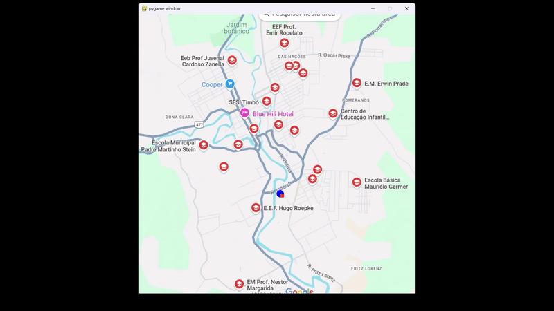

# 🚔 Simulador de Rotas para Atuação Policial em Timbó-SC

Trabalho desenvolvido para a disciplina de **Programação Orientada a Objetos II**, com o objetivo de simular e visualizar **os melhores trajetos** da Polícia Militar até as escolas do município de **Timbó-SC**.

---

## 📌 Objetivo

- Mostrar os **trajetos mais curtos** entre o batalhão da Polícia Militar e os destinos (escolas).
- Permitir a **criação, combinação e consulta de trajetos** salvos em banco de dados.
- Simular rotas com movimentação visual em um **mapa da cidade**.

---

## 🗺️ Funcionalidades

- Mapa da cidade de Timbó com batalhão e escolas visíveis.
- Carro controlável via teclado para registrar caminhos.
- Salvamento de trajetos no banco de dados SQLite.
- Combinação de trajetos em **viagens completas**.
- Consulta automática da **melhor viagem** para um destino.
- Visualização animada de múltiplas viagens em sequência.

---

## 🎮 Controles

| Tecla        | Ação                                                                 |
|--------------|----------------------------------------------------------------------|
| ⬅️ ⬆️ ➡️ ⬇️  | Movimenta o carro pela tela                                           |
| `ENTER`      | Salva o trajeto atual no banco de dados                              |
| `R`          | Reinicia a posição do carro no batalhão da Polícia Militar           |
| `C`          | Combina trajetos informados para formar uma viagem                   |
| `V`          | Solicita destino e mostra a melhor viagem até ele                    |
| `ESPAÇO`     | Mostra automaticamente as melhores viagens para os destinos C, F, I, L|

---

## 🧱 Construção

Este projeto foi desenvolvido utilizando a linguagem Python e a biblioteca Pygame para a criação da interface gráfica e simulação.

---

## 🎥 Demonstração da Simulação

---

## 📽️ Veja o vídeo completo [aqui](https://drive.google.com/file/d/1hjmoIjGgWqBwmu1uLFk_YhYxjw8wYe73/view?usp=sharing)

